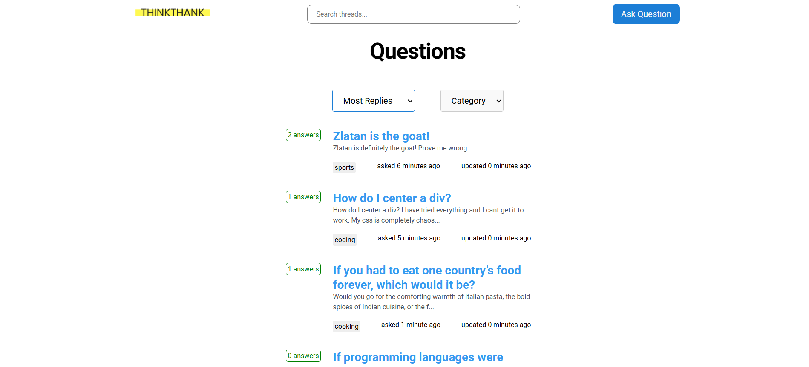

# Q&A Forum Application



## Description

This is a full-stack Q&A forum application built with React (frontend) and Node.js/Express (backend). Users can post questions, provide answers, and engage in discussions across various topics including coding, cooking, and sports. The application features sorting, filtering, and real-time updates for an interactive user experience.

## Features

- Create, read, update, and delete questions
- Post and manage answers
- Sort questions by newest, most replies, or latest activity
- Filter questions by category
- Real-time content preview
- Responsive design for mobile and desktop

## Tech Stack

### Frontend

- React
- Vite
- React Router
- CSS for styling

### Backend

- Node.js
- Express
- MySQL database

## Installation

### Prerequisites

- Node.js (v14 or higher)
- MySQL server
- Git

### Backend Setup

1. Clone the repository

```bash
git clone https://github.com/Joel-Persson1/assignment.git
```

2. Navigate to the backend directory

```bash
cd assignment/backend
```

3. Install dependencies

```bash
npm install
```

4. Create a `.env` file in the backend directory with the following content:

```
DATABASE_PATH = your_mysql_connection_string
```

5. Start the backend server

```bash
nodemon server.js
```

The backend server will run on `http://localhost:3000`

### Frontend Setup

1. Navigate to the frontend directory

```bash
cd assignment/frontend
```

2. Install dependencies

```bash
npm install
```

3. Start the frontend development server

```bash
npm run dev
```

The frontend application will run on `http://localhost:5173`

## Available Scripts

### Backend

- `nodemon server.js`: Starts the backend server

### Frontend

- `npm run dev`: Starts the development server

## Project Structure

### Backend

```
backend/
├── controllers/    # Request handlers
├── middlewares/    # Custom middleware functions
├── models/        # Database models
├── routes/        # API routes
├── utilities/     # Helper functions
└── server.js      # Main application file
```

### Frontend

```
├── frontend/
│   ├── package.json
│   ├── vite.config.js
│   ├── src/
│   │   ├── main.jsx        # Frontend start file
│   │   ├── components/     # React components
│   │   ├── pages/          # Components with a Route
│   │   ├── context/        # Context
│   │   ├── hooks/          # Custom hooks
│   │   ├── styles/         # Global and componentbased css-files
│   │   └── assets/         # SVGS

```

## API Endpoints

- `GET /api/threads` - Get all questions
- `POST /api/threads` - Create a new question
- `GET /api/threads/:id` - Get a specific question
- `PUT /api/threads/:id` - Update a question
- `DELETE /api/threads/:id` - Delete a question
- `GET /api/answers/:threadId` - Get answers for a question
- `POST /api/answers` - Post a new answer

## Additional Information

- The application uses MySQL for data persistence
- Frontend routing is handled by React Router
- Error handling is implemented both on the frontend and backend
